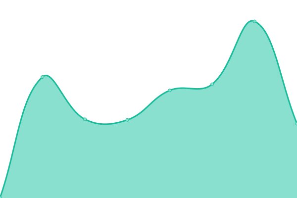

# [📈 Live Status](https://status.terlouw.ai): <!--live status--> **🟧 Partial outage**

This repository contains the open-source uptime monitor and status page for [Mixtery](https://status.terlouw.ai), powered by [Upptime](https://github.com/upptime/upptime).

With [Upptime](https://upptime.js.org), you can get your own unlimited and free uptime monitor and status page, powered entirely by a GitHub repository. We use [Issues](https://github.com/Mixtery/mixtery.github.io/issues) as incident reports, [Actions](https://github.com/Mixtery/mixtery.github.io/actions) as uptime monitors, and [Pages](https://status.terlouw.ai) for the status page.

<!--start: status pages-->
<!-- This summary is generated by Upptime (https://github.com/upptime/upptime) -->
<!-- Do not edit this manually, your changes will be overwritten -->
<!-- prettier-ignore -->
| URL | Status | History | Response Time | Uptime |
| --- | ------ | ------- | ------------- | ------ |
|  [Webserver](https://terlouw.ai) | 🟩 Up | [webserver.yml](https://github.com/Mixtery/mixtery.github.io/commits/HEAD/history/webserver.yml) | 

 2911ms
     
 | 

<a href="https://status.terlouw.ai/history/webserver">100.00%</a>
    

|  [Mailserver](https://outlook.office.com) | 🟩 Up | [mailserver.yml](https://github.com/Mixtery/mixtery.github.io/commits/HEAD/history/mailserver.yml) | 

 263ms
     
 | 

<a href="https://status.terlouw.ai/history/mailserver">86.55%</a>
    

|  [athena.terlouw.ai](https://athena.terlouw.ai) | 🟩 Up | [athena-terlouw-ai.yml](https://github.com/Mixtery/mixtery.github.io/commits/HEAD/history/athena-terlouw-ai.yml) | 

 484ms
     
 | 

<a href="https://status.terlouw.ai/history/athena-terlouw-ai">100.00%</a>
    

|  [artemis.terlouw.ai](https://artemis.terlouw.ai) | 🟩 Up | [artemis-terlouw-ai.yml](https://github.com/Mixtery/mixtery.github.io/commits/HEAD/history/artemis-terlouw-ai.yml) | 

 437ms
     
 | 

<a href="https://status.terlouw.ai/history/artemis-terlouw-ai">100.00%</a>
    

|  [API 3.6b](https://terlouw.io) | 🟩 Up | [api-3-6b.yml](https://github.com/Mixtery/mixtery.github.io/commits/HEAD/history/api-3-6b.yml) | 

 389ms
     
 | 

<a href="https://status.terlouw.ai/history/api-3-6b">100.00%</a>
    

|  [LinkCon 3 - Partner](https://terlouw.legal) | 🟩 Up | [link-con-3-partner.yml](https://github.com/Mixtery/mixtery.github.io/commits/HEAD/history/link-con-3-partner.yml) | 

 5099ms
     
 | 

<a href="https://status.terlouw.ai/history/link-con-3-partner">100.00%</a>
    

|  [Kantoor Link](https://office.terlouw.ai) | 🟥 Down | [kantoor-link.yml](https://github.com/Mixtery/mixtery.github.io/commits/HEAD/history/kantoor-link.yml) | 

 7984ms
     
 | 

<a href="https://status.terlouw.ai/history/kantoor-link">0.00%</a>
    

<!--end: status pages-->

[**Visit our status website →**](https://status.terlouw.ai)

## 📄 License

- Powered by: [Upptime](https://github.com/upptime/upptime)
- Code: [MIT](./LICENSE) © [Mixtery](https://status.terlouw.ai)
- Data in the `./history` directory: [Open Database License](https://opendatacommons.org/licenses/odbl/1-0/)
